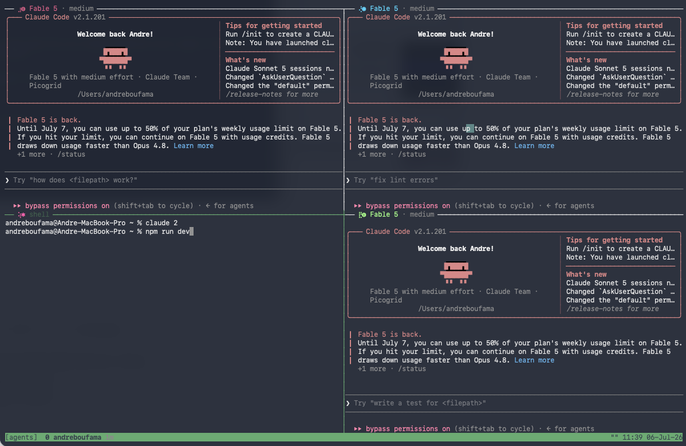

# claude-agents-tmux



A tmux mission-control setup for running many [Claude Code](https://claude.com/claude-code) agents at once.

One persistent tmux session (`agents`) holds all your agentic work:

- **Tab = folder, always exactly one.** Typing `claude` in any project opens (or rejoins) that folder's tab in the `agents` session — no matter where you type it: outside tmux, inside the agents session, or inside some other tmux session, you always land on that folder's tab. New folder → new tab. Same folder → same tab, same running agents. If duplicate tabs for one folder ever appear (e.g. two `claude`s racing), they're automatically merged back into one.
- **Pane = agent.** `claude 4` gives the current folder's tab four *running* agents in a tiled layout. Inside your folder's own tab, `claude 3` turns the current pane into an agent plus two siblings. Idle shell panes are relaunched in place before any new splits are added.
- **Exiting an agent never kills the pane.** Ctrl-C / `/exit` / a crash drops the pane to a normal shell in the same folder — type `claude` to relaunch, or `exit` to actually close the pane. Tabs are never locked to Claude.
- **Tabs show their age.** Each tab's running time is rendered in the status bar — dim under a day, amber at 1–3 days, red past 3 days, so long-forgotten agents stand out.
- **Every pane has a color identity.** The pane border shows a procedural sigil (a color + glyph pair hashed from the pane id, stable and unique per split) plus the agent's model, effort level, and cumulative session tokens (`· 12.4M tok`) — nothing more, so borders stay quiet. Claude Code's own spinner line inside the pane is themed to the same color, so you always know which agent you're looking at.
- **No trust popups.** The wrapper pre-accepts Claude Code's "Do you trust the files in this folder?" dialog for the folder before spawning panes, so a burst of new agents doesn't stall on one prompt per pane. This covers the home directory too: Claude Code never saves an interactive acceptance for `~`, but it does honor a pre-seeded one, and the wrapper re-seeds on every launch.

```
┌ ⣷◆ Fable 5 · high ────────────────┬ ⡪✦ Fable 5 · high ─────────────────┐
│                                   │                                    │
│  agent 1                          │  agent 2                           │
│                                   │                                    │
└───────────────────────────────────┴────────────────────────────────────┘
  1 game-engine 2d4h   2 website 3h   3 api 41m
```

Agents run under `caffeinate`, so your Mac won't idle-sleep while they work, and they survive closed terminal windows, dropped SSH, and wifi blips — reattach by typing `claude` again in the same folder.

## Install

Requires [tmux](https://github.com/tmux/tmux) — on macOS the installer will `brew install tmux` for you if it's missing (or install it yourself first with `brew install tmux`).

One command:

```sh
git clone https://github.com/aboufama/claude-agents-tmux ~/.claude-agents-tmux && ~/.claude-agents-tmux/install.sh
```

(Or clone anywhere you like and run `./install.sh` from the checkout.)

The installer copies the scripts to `~/.claude/agents-tmux/`, appends a `source` line for `claude-agents.zsh` to your `~/.zshrc`, and wires the `statusLine` hook into `~/.claude/settings.json` automatically (your previous settings file is backed up as `settings.json.bak`). If `python3` isn't available it prints the snippet to add by hand instead.

Then open a new terminal (or `source ~/.zshrc`) and run `claude`.

## Usage

| Command | Effect |
|---|---|
| `claude` | Open/rejoin the `agents` session at this folder's tab |
| `claude 4` | Ensure this folder's tab has 4 running agents |
| `claude` (in this folder's tab) | Current pane becomes an agent |
| `claude 3` (in this folder's tab) | Current pane becomes an agent + 2 sibling splits |
| `claude` (any other tmux window/session) | Jumps to this folder's tab, creating it if needed |
| `claude -p ...`, `claude mcp`, pipes | Pass through untouched, no tmux |
| `tmux` (bare, outside tmux) | Asks "open the agents manager?" — `y` attaches to `agents`, anything else is stock tmux |

Handy tmux keys: `Ctrl-b z` zoom a pane full-screen, `Ctrl-b d` detach (agents keep running), `Ctrl-b n`/`p` next/previous tab.

## Cloud mode

Everything above runs on your Mac, which means agents stall the moment the laptop sleeps or drops off wifi. Cloud mode moves the whole `agents` session to an always-on host; your laptop becomes a detachable window into it. Close the lid mid-task, reopen an hour later, type `claude` — the agents never stopped.

Point the wrapper at your host once:

```sh
echo 'user@your-host' > ~/.claude/agents-tmux/remote
```

From then on, **remote is the default**: `claude` in any local folder opens that folder's tab in the remote agents session over SSH (the local folder *name* maps to `~/work/<name>` on the host — keep your repos cloned there). `claude 3` works the same way. Wifi drop = tmux detach on the server; nothing dies. The remote session marks itself with an amber `[remote]` tag next to the session name in the status bar, so you always know which side you're on.

If the host doesn't answer within 3 seconds, `claude` prints a notice and opens a local session instead — it always opens *something*. `CLAUDE_AGENTS_LOCAL=1 claude` forces a local session on purpose.

### Option A: bare VPS

Any $5 VM (Hetzner, DigitalOcean, EC2…):

```sh
ssh user@your-host
git clone https://github.com/aboufama/claude-agents-tmux && ./claude-agents-tmux/install.sh
claude setup-token        # authenticate once (needs a Claude subscription)
mkdir -p ~/work && cd ~/work && git clone <your repos>
```

### Option B: Docker

The `cloud/` directory ships a ready image (Debian + zsh + tmux + Claude Code + this setup):

```sh
ssh user@your-host          # any machine with Docker
git clone https://github.com/aboufama/claude-agents-tmux && cd claude-agents-tmux/cloud
docker compose up -d --build
docker exec -it claude-agents claude setup-token    # authenticate once
```

Then on your laptop: `echo 'user@your-host docker' > ~/.claude/agents-tmux/remote`. The wrapper attaches through `docker exec` automatically. Auth and workspace live in named volumes (`claude-config`, `work`), so they survive image rebuilds and host reboots (`restart: unless-stopped`).

For flaky links, [mosh](https://mosh.org) instead of ssh makes reattaching instant, and for repo-scoped tasks with zero infrastructure, [Claude Code on the web](https://claude.ai/code) runs sessions in Anthropic-managed cloud sandboxes.

## Caveats

- tmux ≥ 3.2, zsh, macOS (`caffeinate` is macOS-only — on Linux, remove it from `scripts/agent-launch.sh` or swap in `systemd-inhibit`).
- **The wrapper auto-appends `--dangerously-skip-permissions` to interactive agents.** That is the point of the setup — unattended agents that never stall on a prompt — but it means agents run without permission guardrails. Remove the `extra=(--dangerously-skip-permissions)` line in `claude-agents.zsh` if you don't want that.
- Per-pane spinner colors work by dropping tiny theme files in `~/.claude/themes/` (named `agents-pane-*`) and passing `--settings '{"theme":"custom:..."}'` to each agent; your global theme is untouched.
- To survive a closed laptop lid you additionally need `sudo pmset -a disablesleep 1`.
